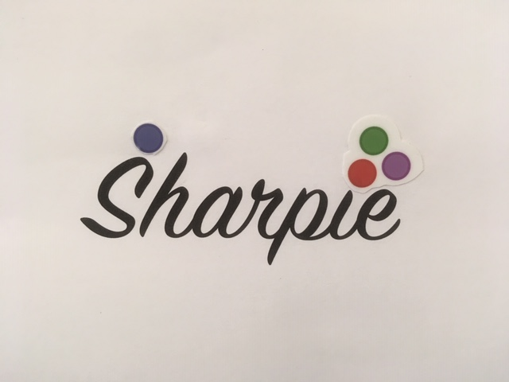
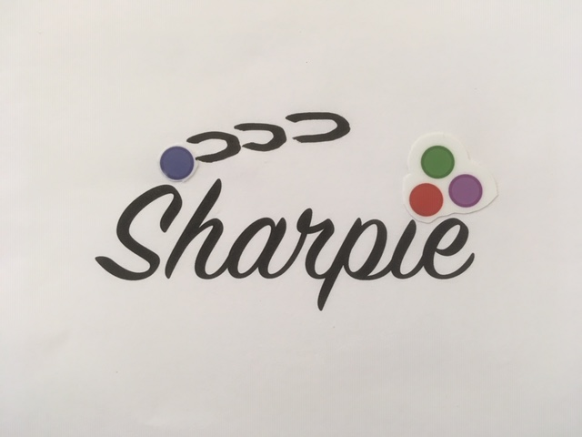

[](https://travis-ci.org/gaelforget/Sharpie.jl)
[](https://mybinder.org/v2/gh/gaelforget/Sharpie.jl/master?filepath=notebooks%2FSharpieDemo.ipynb)

_Dumb fake_ a little bit like _deep fake_ but somewhat less profound and more computationally efficient. 

## Try it

Hit `launch binder` to use cloud computing or open `notebooks/SharpieDemo.ipynb` using `jupyter` on your local computer. This notebook will execute

```
using Sharpie
Sharpie.BeforeAndAfter()
```

and display two images -- `before` and `after` applying `Sharpie`:

 

ps: very advanced tech indeed ... :wink:

## Install it

Start `julia` or a `Jupyter` notebook and execute:

```
using Pkg
Pkg.add("Sharpie")
Pkg.test("sharpie")
```
